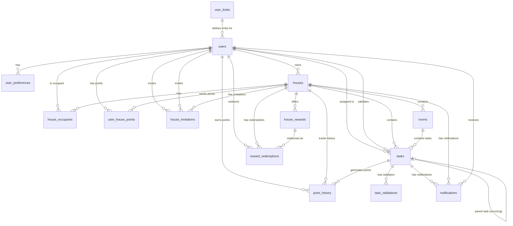

# Bitify Database Schema Guide

## Overview

Este documento describe en detalle el esquema de base de datos de Bitify, implementado en Supabase (PostgreSQL). La base de datos está diseñada para gestionar usuarios, casas, tareas, puntos, premios e invitaciones, siguiendo los principios de Clean Architecture y las mejores prácticas de diseño de bases de datos relacionales.

## Estructura General

La base de datos está organizada en **14 tablas principales** que se relacionan entre sí para formar un sistema completo de gestión de tareas del hogar:

1. **Usuarios y Perfiles**: `users`, `user_preferences`, `user_limits`
2. **Casas y Organización**: `houses`, `house_occupants`, `rooms`
3. **Tareas**: `tasks`, `task_validations`
4. **Sistema de Puntos**: `user_house_points`, `point_history`
5. **Premios**: `house_rewards`, `reward_redemptions`
6. **Invitaciones**: `house_invitations`
7. **Notificaciones**: `notifications`

## Diagrama de Relaciones



## Tablas Principales

### 1. Users (Usuarios)

**¿Qué es?**
La tabla `users` extiende la información de autenticación de Supabase (`auth.users`) con datos adicionales del perfil del usuario.

**Ubicación en la BD**: `users`

**Campos**:

| Campo        | Tipo        | Descripción                           |
| ------------ | ----------- | ------------------------------------- |
| `id`         | UUID        | ID del usuario (FK a `auth.users.id`) |
| `email`      | TEXT        | Email del usuario                     |
| `full_name`  | TEXT        | Nombre completo (nullable)            |
| `avatar_url` | TEXT        | URL del avatar (nullable)             |
| `user_type`  | ENUM        | Tipo de usuario: `'free'` o `'pro'`   |
| `created_at` | TIMESTAMPTZ | Fecha de creación                     |
| `updated_at` | TIMESTAMPTZ | Fecha de última actualización         |

**Relaciones**:

- Un usuario puede ser dueño de múltiples casas (`houses.owner_id`)
- Un usuario puede ser ocupante de múltiples casas (`house_occupants.user_id`)
- Un usuario tiene preferencias (`user_preferences.user_id`)
- Un usuario tiene puntos por cada casa (`user_house_points.user_id`)

**Reglas de Negocio**:

- El usuario se crea automáticamente cuando se registra en `auth.users` (trigger `handle_new_user`)
- El tipo de usuario (`user_type`) determina los límites que puede tener (ver `user_limits`)

**Ejemplo de Uso**:

```sql
-- Obtener usuario
SELECT * FROM users WHERE id = 'user-uuid';

-- Actualizar nombre de usuario
UPDATE users
SET full_name = 'Juan Pérez', updated_at = NOW()
WHERE id = 'user-uuid';
```

**Tipos TypeScript**: Ver `src/modules/account/types/account.types.ts`

```typescript
// Ejemplo de tipos disponibles
import type {
  Profile,
  UserType,
  CreateProfileParams,
  UpdateProfileParams,
} from '@modules/account/types/account.types';
```

---

### 2. User Preferences (Preferencias de Usuario)

**¿Qué es?**
Almacena las preferencias de configuración de cada usuario (tema, idioma, notificaciones). Estas preferencias se sincronizan entre la base de datos y el storage local del dispositivo.

**Ubicación en la BD**: `user_preferences`

**Campos**:

| Campo                                   | Tipo        | Descripción                                                       |
| --------------------------------------- | ----------- | ----------------------------------------------------------------- |
| `id`                                    | UUID        | ID único de la preferencia                                        |
| `user_id`                               | UUID        | ID del usuario (FK a `users.id`)                                  |
| `theme`                                 | TEXT        | Tema: `'light'`, `'dark'` o `'auto'`                              |
| `language`                              | TEXT        | Idioma: `'es'` o `'en'`                                           |
| `notifications_enabled`                 | BOOLEAN     | Si todas las notificaciones están habilitadas (global)            |
| `notifications_task_reminder_enabled`   | BOOLEAN     | Si las notificaciones de recordatorio de tareas están habilitadas |
| `notifications_task_validation_enabled` | BOOLEAN     | Si las notificaciones de validación de tareas están habilitadas   |
| `notifications_member_joined_enabled`   | BOOLEAN     | Si las notificaciones de nuevo miembro están habilitadas          |
| `notifications_member_left_enabled`     | BOOLEAN     | Si las notificaciones de miembro que se va están habilitadas      |
| `created_at`                            | TIMESTAMPTZ | Fecha de creación                                                 |
| `updated_at`                            | TIMESTAMPTZ | Fecha de última actualización                                     |

**Relaciones**:

- Una preferencia pertenece a un usuario (`users.id`)

**Reglas de Negocio**:

- Se crea automáticamente cuando se registra un usuario (trigger `handle_new_user`)
- Solo puede haber una preferencia por usuario (constraint `UNIQUE(user_id)`)
- Los valores por defecto son: `theme = 'auto'`, `language = 'es'`, `notifications_enabled = true`
- Todos los tipos de notificaciones específicos están habilitados por defecto (`true`)
- **Lógica de notificaciones**: Una notificación se envía solo si:
  1. `notifications_enabled = true` (habilitación global)
  2. El tipo específico de notificación está habilitado (ej: `notifications_task_reminder_enabled = true`)
  3. Para tareas: la tarea tiene `notification_enabled = true`
- Si se desactiva un tipo de notificación en preferencias, no se envían esas notificaciones, pero la configuración de la tarea se mantiene (para reactivarlas en el futuro)

**Sincronización con Storage Local**:
Las preferencias se cargan desde la base de datos al iniciar sesión y se sincronizan con el storage local del dispositivo. Si hay cambios en la BD, estos sobrescriben el storage local.

**Ejemplo de Uso**:

```sql
-- Obtener preferencias de usuario
SELECT * FROM user_preferences WHERE user_id = 'user-uuid';

-- Cambiar tema a dark mode
UPDATE user_preferences
SET theme = 'dark', updated_at = NOW()
WHERE user_id = 'user-uuid';
```

**Tipos TypeScript**: Ver `src/modules/preferences/types/preferences.types.ts`

```typescript
// Ejemplo de tipos disponibles
import type {
  UserPreferences,
  Theme,
  AppLanguage,
  CreateUserPreferencesParams,
  UpdateUserPreferencesParams,
} from '@modules/preferences/types/preferences.types';
```

---

### 3. User Limits (Límites de Usuarios)

**¿Qué es?**
Define los límites que tienen los usuarios según su tipo (FREE vs PRO). Esta tabla es de solo lectura desde la aplicación y se usa para validar operaciones.

**Ubicación en la BD**: `user_limits`

**Campos**:

| Campo                            | Tipo    | Descripción                                  |
| -------------------------------- | ------- | -------------------------------------------- |
| `id`                             | UUID    | ID único                                     |
| `user_type`                      | ENUM    | Tipo de usuario: `'free'` o `'pro'` (UNIQUE) |
| `max_houses`                     | INTEGER | Máximo de casas que puede tener              |
| `max_occupants_with_permissions` | INTEGER | Máximo de ocupantes con permisos             |
| `max_tasks_per_house`            | INTEGER | Máximo de tareas por casa                    |
| `max_rooms_per_house`            | INTEGER | Máximo de habitaciones por casa              |
| `max_rewards_per_house`          | INTEGER | Máximo de premios por casa                   |

**Valores por Defecto**:

| Límite                 | FREE | PRO |
| ---------------------- | ---- | --- |
| Casas                  | 1    | 5   |
| Ocupantes con permisos | 0    | 10  |
| Tareas por casa        | 20   | 100 |
| Habitaciones por casa  | 5    | 10  |
| Premios por casa       | 5    | 20  |

**Reglas de Negocio**:

- Los límites se validan en la capa de aplicación (services) antes de crear/actualizar recursos
- Un usuario FREE solo puede ser dueño de 1 casa
- Un usuario FREE no puede tener ocupantes con permisos
- Un usuario PRO puede tener hasta 5 casas y 10 ocupantes con permisos por casa

**Ejemplo de Uso**:

```sql
-- Obtener límites de usuario FREE
SELECT * FROM user_limits WHERE user_type = 'free';

-- Validar si un usuario puede crear más casas
SELECT
  COUNT(*) as current_houses,
  ul.max_houses
FROM houses h
JOIN user_limits ul ON ul.user_type = (SELECT user_type FROM users WHERE id = h.owner_id)
WHERE h.owner_id = 'user-uuid'
GROUP BY ul.max_houses;
```

**Tipos TypeScript**: Ver `src/shared/types/database.types.ts`

```typescript
// Ejemplo de tipos disponibles
import type { UserLimits } from '@shared/types/database.types';
```

---

### 4. Houses (Casas)

**¿Qué es?**
Representa una casa o hogar donde se gestionan tareas. Cada casa tiene un dueño, ocupantes, habitaciones, tareas y configuración de puntos.

**Ubicación en la BD**: `houses`

**Campos**:

| Campo                           | Tipo        | Descripción                                                                        |
| ------------------------------- | ----------- | ---------------------------------------------------------------------------------- |
| `id`                            | UUID        | ID único de la casa                                                                |
| `name`                          | TEXT        | Nombre de la casa                                                                  |
| `description`                   | TEXT        | Descripción (nullable)                                                             |
| `owner_id`                      | UUID        | ID del dueño (FK a `users.id`)                                                     |
| `points_expiration_type`        | ENUM        | Tipo de expiración: `'none'`, `'weekly'`, `'monthly'`, `'yearly'`, `'custom_date'` |
| `points_expiration_custom_date` | DATE        | Fecha personalizada (solo si `points_expiration_type = 'custom_date'`)             |
| `created_at`                    | TIMESTAMPTZ | Fecha de creación                                                                  |
| `updated_at`                    | TIMESTAMPTZ | Fecha de última actualización                                                      |

**Relaciones**:

- Una casa pertenece a un dueño (`users.id`)
- Una casa tiene múltiples ocupantes (`house_occupants.house_id`)
- Una casa tiene múltiples habitaciones (`rooms.house_id`)
- Una casa tiene múltiples tareas (`tasks.house_id`)
- Una casa tiene múltiples premios (`house_rewards.house_id`)

**Reglas de Negocio**:

- Al crear una casa, se crea automáticamente el dueño como ocupante con rol `'owner'` (trigger `create_house_owner`)
- El dueño no puede ser eliminado de los ocupantes
- La configuración de expiración de puntos afecta a todos los puntos ganados en esa casa

**Tipos de Expiración de Puntos**:

- **`none`**: Los puntos nunca expiran
- **`weekly`**: Los puntos expiran el último día de la semana (domingo) en que se ganaron
- **`monthly`**: Los puntos expiran el último día del mes en que se ganaron
- **`yearly`**: Los puntos expiran el último día del año en que se ganaron
- **`custom_date`**: Los puntos expiran en una fecha específica definida en `points_expiration_custom_date`

**Ejemplo de Uso**:

```sql
-- Crear una nueva casa
INSERT INTO houses (name, description, owner_id, points_expiration_type)
VALUES ('Casa Principal', 'Mi casa familiar', 'user-uuid', 'monthly');

-- Obtener todas las casas de un usuario (como dueño o ocupante)
SELECT DISTINCT h.*
FROM houses h
LEFT JOIN house_occupants ho ON ho.house_id = h.id
WHERE h.owner_id = 'user-uuid' OR ho.user_id = 'user-uuid';
```

**Tipos TypeScript**: Ver `src/modules/house/types/house.types.ts`

```typescript
// Ejemplo de tipos disponibles
import type {
  House,
  PointsExpirationType,
  CreateHouseParams,
  UpdateHouseParams,
} from '@modules/house/types/house.types';
```

---

### 5. House Occupants (Ocupantes de Casas)

**¿Qué es?**
Relaciona usuarios con casas, definiendo el rol que tiene cada usuario en cada casa.

**Ubicación en la BD**: `house_occupants`

**Campos**:

| Campo        | Tipo        | Descripción                                                 |
| ------------ | ----------- | ----------------------------------------------------------- |
| `id`         | UUID        | ID único                                                    |
| `house_id`   | UUID        | ID de la casa (FK a `houses.id`)                            |
| `user_id`    | UUID        | ID del usuario (FK a `users.id`)                            |
| `role`       | ENUM        | Rol: `'owner'`, `'occupant_with_permissions'`, `'occupant'` |
| `created_at` | TIMESTAMPTZ | Fecha de creación                                           |
| `updated_at` | TIMESTAMPTZ | Fecha de última actualización                               |

**Roles**:

- **`owner`**: Dueño de la casa. Puede hacer todo (crear/editar/eliminar tareas, gestionar ocupantes, etc.)
- **`occupant_with_permissions`**: Ocupante con permisos. Puede crear/editar tareas, validar tareas, gestionar habitaciones y premios
- **`occupant`**: Ocupante regular. Solo puede ver y completar tareas asignadas

**Relaciones**:

- Un ocupante pertenece a una casa (`houses.id`)
- Un ocupante es un usuario (`users.id`)

**Reglas de Negocio**:

- Un usuario solo puede tener un rol por casa (constraint `UNIQUE(house_id, user_id)`)
- El dueño se crea automáticamente al crear la casa
- Los ocupantes con permisos solo pueden ser creados por usuarios PRO
- Un usuario FREE no puede tener ocupantes con permisos en sus casas

**Ejemplo de Uso**:

```sql
-- Agregar un ocupante a una casa
INSERT INTO house_occupants (house_id, user_id, role)
VALUES ('house-uuid', 'user-uuid', 'occupant');

-- Obtener todos los ocupantes de una casa con sus roles
SELECT
  ho.role,
  p.full_name,
  p.email
FROM house_occupants ho
JOIN users u ON u.id = ho.user_id
WHERE ho.house_id = 'house-uuid';
```

**Tipos TypeScript**: Ver `src/modules/house/types/house.types.ts`

```typescript
// Ejemplo de tipos disponibles
import type {
  HouseOccupant,
  OccupantRole,
  CreateHouseOccupantParams,
  UpdateHouseOccupantParams,
} from '@modules/house/types/house.types';
```

---

### 6. Rooms (Habitaciones)

**¿Qué es?**
Representa las habitaciones o espacios dentro de una casa. Las tareas pueden estar asignadas a una habitación específica o ser generales (sin habitación).

**Ubicación en la BD**: `rooms`

**Campos**:

| Campo         | Tipo        | Descripción                      |
| ------------- | ----------- | -------------------------------- |
| `id`          | UUID        | ID único de la habitación        |
| `house_id`    | UUID        | ID de la casa (FK a `houses.id`) |
| `name`        | TEXT        | Nombre de la habitación          |
| `description` | TEXT        | Descripción (nullable)           |
| `created_at`  | TIMESTAMPTZ | Fecha de creación                |
| `updated_at`  | TIMESTAMPTZ | Fecha de última actualización    |

**Relaciones**:

- Una habitación pertenece a una casa (`houses.id`)
- Una habitación puede tener múltiples tareas (`tasks.room_id`)

**Reglas de Negocio**:

- No se pueden eliminar habitaciones que tienen tareas asignadas
- Antes de eliminar una habitación, las tareas deben moverse a otra habitación o marcarse como generales (`room_id = NULL`)
- Solo el dueño y ocupantes con permisos pueden gestionar habitaciones

**Ejemplo de Uso**:

```sql
-- Crear una habitación
INSERT INTO rooms (house_id, name, description)
VALUES ('house-uuid', 'Cocina', 'Cocina principal de la casa');

-- Obtener todas las habitaciones de una casa con conteo de tareas
SELECT
  r.*,
  COUNT(t.id) as task_count
FROM rooms r
LEFT JOIN tasks t ON t.room_id = r.id
WHERE r.house_id = 'house-uuid'
GROUP BY r.id;
```

**Tipos TypeScript**: Ver `src/modules/house/types/house.types.ts`

```typescript
// Ejemplo de tipos disponibles
import type {
  Room,
  CreateRoomParams,
  UpdateRoomParams,
} from '@modules/house/types/house.types';
```

---

### 7. Tasks (Tareas)

**¿Qué es?**
Representa una tarea del hogar que debe ser completada. Las tareas pueden ser recurrentes, tener validación, y otorgan puntos según cómo se completen.

**Ubicación en la BD**: `tasks`

**Campos**:

| Campo                         | Tipo        | Descripción                                                             |
| ----------------------------- | ----------- | ----------------------------------------------------------------------- |
| `id`                          | UUID        | ID único de la tarea                                                    |
| `house_id`                    | UUID        | ID de la casa (FK a `houses.id`)                                        |
| `room_id`                     | UUID        | ID de la habitación (FK a `rooms.id`, nullable)                         |
| `title`                       | TEXT        | Título de la tarea                                                      |
| `description`                 | TEXT        | Descripción (nullable)                                                  |
| `assigned_to`                 | UUID        | ID del usuario asignado (FK a `users.id`)                               |
| `validator_id`                | UUID        | ID del validador designado (FK a `users.id`, nullable)                  |
| `requires_validation`         | BOOLEAN     | Si requiere validación                                                  |
| `points_on_time`              | INTEGER     | Puntos por completar a tiempo                                           |
| `points_extended`             | INTEGER     | Puntos por completar en plazo extendido                                 |
| `points_not_completed`        | INTEGER     | Puntos perdidos si no se completa                                       |
| `due_date`                    | DATE        | Fecha límite para completar                                             |
| `extended_due_date`           | DATE        | Fecha límite del plazo extendido (calculado)                            |
| `extended_days`               | INTEGER     | Días de plazo extendido                                                 |
| `is_recurring`                | BOOLEAN     | Si es recurrente                                                        |
| `recurrence_type`             | ENUM        | Tipo: `'none'`, `'weekly'`, `'monthly'`, `'yearly'`                     |
| `recurrence_date`             | DATE        | Fecha específica para yearly (nullable)                                 |
| `status`                      | ENUM        | Estado: `'pending'`, `'completed'`, `'validated'`, `'expired'`          |
| `parent_task_id`              | UUID        | ID de la tarea padre (para recurrentes, FK a `tasks.id`)                |
| `completed_at`                | TIMESTAMPTZ | Fecha de completado (nullable)                                          |
| `completed_by`                | UUID        | ID de quien completó (FK a `users.id`, nullable)                        |
| `validated_at`                | TIMESTAMPTZ | Fecha de validación (nullable)                                          |
| `validated_by`                | UUID        | ID de quien validó (FK a `users.id`, nullable)                          |
| `validation_description`      | TEXT        | Descripción de la validación (nullable)                                 |
| `notification_enabled`        | BOOLEAN     | Si la notificación de recordatorio está habilitada para esta tarea      |
| `notification_minutes_before` | INTEGER     | Minutos antes de la fecha límite para enviar la notificación (nullable) |
| `created_at`                  | TIMESTAMPTZ | Fecha de creación                                                       |
| `updated_at`                  | TIMESTAMPTZ | Fecha de última actualización                                           |

**Estados de Tarea**:

- **`pending`**: Tarea pendiente de completar
- **`completed`**: Tarea completada (esperando validación si es requerida)
- **`validated`**: Tarea validada (puntos otorgados)
- **`expired`**: Tarea expirada (no completada a tiempo)

**Tipos de Recurrencia**:

- **`none`**: Tarea única, no recurrente
- **`weekly`**: Se repite semanalmente (ej: cada lunes)
- **`monthly`**: Se repite mensualmente (ej: día 1 de cada mes)
- **`yearly`**: Se repite anualmente en una fecha específica (ej: 20 de diciembre)

**Sistema de Puntos**:

Los puntos se otorgan según cuándo se complete la tarea:

- **A tiempo** (`completed_at <= due_date`): Se otorgan `points_on_time`
- **En plazo extendido** (`due_date < completed_at <= extended_due_date`): Se otorgan `points_extended`
- **No completada** (después de `extended_due_date` o nunca): Se otorgan `points_not_completed` (negativo)

**Validación de Tareas**:

- Si `requires_validation = true`, la tarea debe ser validada antes de otorgar puntos
- Pueden validar: el dueño, ocupantes con permisos, el asignado, o el validador designado (`validator_id`)
- Si `validator_id` es NULL y requiere validación, cualquier usuario autorizado puede validar
- Una tarea solo puede ser validada una vez

**Tareas Recurrentes**:

- Cuando una tarea es recurrente, se crea una nueva tarea en cada ciclo
- La nueva tarea se vincula con la anterior mediante `parent_task_id`
- Esto permite mantener el historial de todas las instancias de la tarea

**Sistema de Notificaciones**:

- El usuario asignado (`assigned_to`) puede activar/desactivar notificaciones por tarea mediante `notification_enabled`
- Si `notification_enabled = true`, se puede configurar `notification_minutes_before` (ej: 60 minutos antes de `due_date`)
- La notificación se envía solo si:
  1. `notification_enabled = true` en la tarea
  2. El usuario tiene `notifications_enabled = true` en sus preferencias (global)
  3. El usuario tiene `notifications_task_reminder_enabled = true` en sus preferencias
- Si se desactiva el tipo de notificación en preferencias, la configuración de la tarea se mantiene (para reactivarla en el futuro)
- Si una notificación se pierde (pasó el tiempo), no se envía retroactivamente

**Reglas de Negocio**:

- `points_extended` debe estar entre `points_not_completed` y `points_on_time`
- Si `recurrence_type = 'yearly'`, `recurrence_date` es obligatorio
- `extended_due_date` se calcula automáticamente: `due_date + extended_days` (trigger)
- Al completar una tarea, se actualizan los puntos automáticamente (trigger `update_points_on_task_completion`)
- `notification_minutes_before` debe ser positivo si está definido

**Ejemplo de Uso**:

```sql
-- Crear una tarea simple
INSERT INTO tasks (
  house_id,
  room_id,
  title,
  description,
  assigned_to,
  points_on_time,
  points_extended,
  points_not_completed,
  due_date,
  extended_days
)
VALUES (
  'house-uuid',
  'room-uuid',
  'Limpiar la cocina',
  'Limpiar todos los platos y superficies',
  'user-uuid',
  10,
  5,
  -5,
  '2025-12-15',
  3
);

-- Crear una tarea recurrente semanal
INSERT INTO tasks (
  house_id,
  title,
  assigned_to,
  is_recurring,
  recurrence_type,
  due_date,
  points_on_time,
  points_extended,
  points_not_completed,
  extended_days
)
VALUES (
  'house-uuid',
  'Sacar la basura',
  'user-uuid',
  true,
  'weekly',
  '2025-12-16', -- Lunes
  10,
  5,
  -5,
  2
);

-- Obtener tareas pendientes de un usuario
SELECT * FROM tasks
WHERE assigned_to = 'user-uuid'
  AND status = 'pending'
  AND due_date >= CURRENT_DATE
ORDER BY due_date ASC;
```

**Tipos TypeScript**: Ver `src/modules/tasks/types/tasks.types.ts`

```typescript
// Ejemplo de tipos disponibles
import type {
  Task,
  TaskStatus,
  RecurrenceType,
  CreateTaskParams,
  UpdateTaskParams,
} from '@modules/tasks/types/tasks.types';
```

---

### 8. Task Validations (Validaciones de Tareas)

**¿Qué es?**
Registra quién y cuándo validó una tarea que requiere validación.

**Ubicación en la BD**: `task_validations`

**Campos**:

| Campo                    | Tipo        | Descripción                              |
| ------------------------ | ----------- | ---------------------------------------- |
| `id`                     | UUID        | ID único                                 |
| `task_id`                | UUID        | ID de la tarea (FK a `tasks.id`, UNIQUE) |
| `validated_by`           | UUID        | ID de quien validó (FK a `users.id`)     |
| `validation_description` | TEXT        | Descripción opcional de la validación    |
| `created_at`             | TIMESTAMPTZ | Fecha de validación                      |

**Relaciones**:

- Una validación pertenece a una tarea (`tasks.id`)
- Una validación es realizada por un usuario (`users.id`)

**Reglas de Negocio**:

- Una tarea solo puede ser validada una vez (constraint `UNIQUE(task_id)`)
- Al crear una validación, se actualiza automáticamente la tarea con `validated_at`, `validated_by` y `status = 'validated'` (trigger `handle_task_validation`)

**Quién Puede Validar**:

- El dueño de la casa
- Ocupantes con permisos
- El usuario asignado a la tarea
- El validador designado (`tasks.validator_id`)
- Si `validator_id` es NULL y requiere validación, cualquier usuario autorizado puede validar

**Ejemplo de Uso**:

```sql
-- Validar una tarea
INSERT INTO task_validations (task_id, validated_by, validation_description)
VALUES (
  'task-uuid',
  'user-uuid',
  'Tarea completada correctamente, todo limpio'
);

-- Obtener historial de validaciones de una casa
SELECT
  tv.*,
  t.title as task_title,
  p.full_name as validator_name
FROM task_validations tv
JOIN tasks t ON t.id = tv.task_id
JOIN users u ON u.id = tv.validated_by
WHERE t.house_id = 'house-uuid'
ORDER BY tv.created_at DESC;
```

**Tipos TypeScript**: Ver `src/modules/tasks/types/tasks.types.ts`

```typescript
// Ejemplo de tipos disponibles
import type {
  TaskValidation,
  CreateTaskValidationParams,
} from '@modules/tasks/types/tasks.types';
```

---

### 9. User House Points (Puntos por Usuario por Casa)

**¿Qué es?**
Almacena el total de puntos acumulados y disponibles de un usuario en una casa específica. Los puntos se acumulan por casa, no globalmente.

**Ubicación en la BD**: `user_house_points`

**Campos**:

| Campo              | Tipo        | Descripción                                  |
| ------------------ | ----------- | -------------------------------------------- |
| `id`               | UUID        | ID único                                     |
| `user_id`          | UUID        | ID del usuario (FK a `users.id`)             |
| `house_id`         | UUID        | ID de la casa (FK a `houses.id`)             |
| `total_points`     | INTEGER     | Puntos totales acumulados (incluye vencidos) |
| `available_points` | INTEGER     | Puntos disponibles (no vencidos)             |
| `created_at`       | TIMESTAMPTZ | Fecha de creación                            |
| `updated_at`       | TIMESTAMPTZ | Fecha de última actualización                |

**Relaciones**:

- Los puntos pertenecen a un usuario (`users.id`)
- Los puntos pertenecen a una casa (`houses.id`)

**Reglas de Negocio**:

- Un usuario solo puede tener un registro de puntos por casa (constraint `UNIQUE(user_id, house_id)`)
- Los puntos se actualizan automáticamente al completar tareas (trigger `update_points_on_task_completion`)
- Los puntos disponibles se reducen cuando se canjean premios
- Los puntos expirados se restan de `available_points` periódicamente (función `expire_points()`)

**Diferencia entre `total_points` y `available_points`**:

- **`total_points`**: Suma de todos los puntos ganados/perdidos, incluyendo los que ya expiraron
- **`available_points`**: Solo los puntos que aún no han expirado y pueden usarse para canjear premios

**Ejemplo de Uso**:

```sql
-- Obtener puntos de un usuario en una casa
SELECT * FROM user_house_points
WHERE user_id = 'user-uuid' AND house_id = 'house-uuid';

-- Obtener ranking de puntos en una casa
SELECT
  p.full_name,
  uhp.total_points,
  uhp.available_points
FROM user_house_points uhp
JOIN users u ON u.id = uhp.user_id
WHERE uhp.house_id = 'house-uuid'
ORDER BY uhp.total_points DESC;
```

**Tipos TypeScript**: Ver `src/shared/types/database.types.ts`

```typescript
// Ejemplo de tipos disponibles
import type {
  UserHousePoints,
  UserLimits,
  PointHistory,
  PointsType,
  CreatePointHistoryParams,
} from '@shared/types/database.types';
```

---

### 10. Point History (Historial de Puntos)

**¿Qué es?**
Registra cada movimiento de puntos (ganados, perdidos, canjeados) con información detallada sobre cuándo y por qué se otorgaron.

**Ubicación en la BD**: `point_history`

**Campos**:

| Campo         | Tipo        | Descripción                                                               |
| ------------- | ----------- | ------------------------------------------------------------------------- |
| `id`          | UUID        | ID único                                                                  |
| `user_id`     | UUID        | ID del usuario (FK a `users.id`)                                          |
| `house_id`    | UUID        | ID de la casa (FK a `houses.id`)                                          |
| `task_id`     | UUID        | ID de la tarea que generó los puntos (FK a `tasks.id`, nullable)          |
| `points`      | INTEGER     | Cantidad de puntos (puede ser positivo o negativo)                        |
| `points_type` | ENUM        | Tipo: `'on_time'`, `'extended'`, `'not_completed'`, `'reward_redemption'` |
| `earned_at`   | TIMESTAMPTZ | Fecha en que se ganaron/perdieron                                         |
| `expires_at`  | TIMESTAMPTZ | Fecha de expiración (NULL si no expiran)                                  |
| `description` | TEXT        | Descripción del movimiento                                                |

**Tipos de Puntos**:

- **`on_time`**: Puntos ganados por completar a tiempo
- **`extended`**: Puntos ganados por completar en plazo extendido
- **`not_completed`**: Puntos perdidos por no completar
- **`reward_redemption`**: Puntos gastados al canjear un premio (negativo)

**Relaciones**:

- Un movimiento pertenece a un usuario (`users.id`)
- Un movimiento pertenece a una casa (`houses.id`)
- Un movimiento puede estar relacionado con una tarea (`tasks.id`)

**Reglas de Negocio**:

- Los puntos se calculan automáticamente al completar tareas según la fecha de completado
- La fecha de expiración se calcula según la configuración de la casa (`houses.points_expiration_type`)
- Los puntos expirados se marcan pero no se eliminan del historial

**Cálculo de Expiración**:

- **`none`**: `expires_at = NULL`
- **`weekly`**: `expires_at = último día de la semana (domingo)`
- **`monthly`**: `expires_at = último día del mes`
- **`yearly`**: `expires_at = último día del año`
- **`custom_date`**: `expires_at = fecha personalizada de la casa`

**Ejemplo de Uso**:

```sql
-- Obtener historial de puntos de un usuario en una casa
SELECT * FROM point_history
WHERE user_id = 'user-uuid' AND house_id = 'house-uuid'
ORDER BY earned_at DESC;

-- Obtener puntos que están por expirar
SELECT * FROM point_history
WHERE user_id = 'user-uuid'
  AND house_id = 'house-uuid'
  AND expires_at IS NOT NULL
  AND expires_at <= NOW() + INTERVAL '7 days'
  AND points > 0
ORDER BY expires_at ASC;

-- Obtener resumen de puntos por tipo
SELECT
  points_type,
  SUM(points) as total_points,
  COUNT(*) as count
FROM point_history
WHERE user_id = 'user-uuid' AND house_id = 'house-uuid'
GROUP BY points_type;
```

**Tipos TypeScript**: Ver `src/shared/types/database.types.ts` (ver sección anterior para ejemplos de importación)

---

### 11. House Rewards (Premios de Casa)

**¿Qué es?**
Representa los premios que se pueden canjear con puntos en una casa. Los premios pueden tener stock limitado.

**Ubicación en la BD**: `house_rewards`

**Campos**:

| Campo           | Tipo        | Descripción                                |
| --------------- | ----------- | ------------------------------------------ |
| `id`            | UUID        | ID único                                   |
| `house_id`      | UUID        | ID de la casa (FK a `houses.id`)           |
| `name`          | TEXT        | Nombre del premio                          |
| `description`   | TEXT        | Descripción (nullable)                     |
| `points_cost`   | INTEGER     | Costo en puntos (debe ser > 0)             |
| `stock_limit`   | INTEGER     | Límite de stock (NULL = ilimitado)         |
| `current_stock` | INTEGER     | Stock actual (NULL si stock_limit es NULL) |
| `is_active`     | BOOLEAN     | Si el premio está activo                   |
| `created_at`    | TIMESTAMPTZ | Fecha de creación                          |
| `updated_at`    | TIMESTAMPTZ | Fecha de última actualización              |

**Relaciones**:

- Un premio pertenece a una casa (`houses.id`)
- Un premio puede ser canjeado múltiples veces (`reward_redemptions.reward_id`)

**Reglas de Negocio**:

- Si `stock_limit` es NULL, el premio tiene stock ilimitado
- Si `stock_limit` no es NULL, `current_stock` debe estar entre 0 y `stock_limit`
- Al canjear un premio, se reduce `current_stock` automáticamente (trigger `update_reward_stock_on_redemption`)
- Si `current_stock` llega a 0, el premio se desactiva automáticamente (`is_active = false`)

**Ejemplo de Uso**:

```sql
-- Crear un premio con stock limitado
INSERT INTO house_rewards (
  house_id,
  name,
  description,
  points_cost,
  stock_limit,
  current_stock
)
VALUES (
  'house-uuid',
  'Pizza gratis',
  'Una pizza grande a elección',
  50,
  10,
  10
);

-- Crear un premio sin límite de stock
INSERT INTO house_rewards (
  house_id,
  name,
  description,
  points_cost
)
VALUES (
  'house-uuid',
  'Día libre de tareas',
  'Un día sin hacer tareas',
  100
);

-- Obtener premios disponibles de una casa
SELECT * FROM house_rewards
WHERE house_id = 'house-uuid'
  AND is_active = true
  AND (stock_limit IS NULL OR current_stock > 0)
ORDER BY points_cost ASC;
```

**Tipos TypeScript**: Ver `src/modules/house/types/house.types.ts`

```typescript
// Ejemplo de tipos disponibles
import type {
  HouseReward,
  RewardRedemption,
  CreateHouseRewardParams,
  CreateRewardRedemptionParams,
} from '@modules/house/types/house.types';
```

---

### 12. Reward Redemptions (Canjes de Premios)

**¿Qué es?**
Registra cada vez que un usuario canjea un premio con sus puntos.

**Ubicación en la BD**: `reward_redemptions`

**Campos**:

| Campo          | Tipo        | Descripción                                      |
| -------------- | ----------- | ------------------------------------------------ |
| `id`           | UUID        | ID único                                         |
| `reward_id`    | UUID        | ID del premio canjeado (FK a `house_rewards.id`) |
| `user_id`      | UUID        | ID del usuario que canjeó (FK a `users.id`)      |
| `house_id`     | UUID        | ID de la casa (FK a `houses.id`)                 |
| `points_spent` | INTEGER     | Puntos gastados (debe ser > 0)                   |
| `redeemed_at`  | TIMESTAMPTZ | Fecha de canje                                   |

**Relaciones**:

- Un canje pertenece a un premio (`house_rewards.id`)
- Un canje pertenece a un usuario (`users.id`)
- Un canje pertenece a una casa (`houses.id`)

**Reglas de Negocio**:

- Al canjear un premio, se reduce automáticamente el stock (si tiene límite)
- Se registra en `point_history` como gasto (tipo `'reward_redemption'`)
- Se reduce `available_points` del usuario en esa casa
- Solo se pueden canjear premios con puntos disponibles (no vencidos)

**Ejemplo de Uso**:

```sql
-- Canjear un premio
INSERT INTO reward_redemptions (reward_id, user_id, house_id, points_spent)
VALUES (
  'reward-uuid',
  'user-uuid',
  'house-uuid',
  50
);

-- Obtener historial de canjes de un usuario
SELECT
  rr.*,
  hr.name as reward_name,
  hr.description as reward_description
FROM reward_redemptions rr
JOIN house_rewards hr ON hr.id = rr.reward_id
WHERE rr.user_id = 'user-uuid'
ORDER BY rr.redeemed_at DESC;

-- Obtener premios más canjeados en una casa
SELECT
  hr.name,
  COUNT(rr.id) as redemption_count,
  SUM(rr.points_spent) as total_points_spent
FROM house_rewards hr
LEFT JOIN reward_redemptions rr ON rr.reward_id = hr.id
WHERE hr.house_id = 'house-uuid'
GROUP BY hr.id, hr.name
ORDER BY redemption_count DESC;
```

**Tipos TypeScript**: Ver `src/modules/house/types/house.types.ts` (ver sección anterior para ejemplos de importación)

---

### 13. House Invitations (Invitaciones a Casas)

**¿Qué es?**
Registra las invitaciones que se envían a usuarios para unirse a una casa como ocupantes.

**Ubicación en la BD**: `house_invitations`

**Campos**:

| Campo             | Tipo        | Descripción                                                          |
| ----------------- | ----------- | -------------------------------------------------------------------- |
| `id`              | UUID        | ID único                                                             |
| `house_id`        | UUID        | ID de la casa (FK a `houses.id`)                                     |
| `invited_by`      | UUID        | ID de quien envió la invitación (FK a `users.id`)                    |
| `invited_user_id` | UUID        | ID del usuario invitado (FK a `users.id`)                            |
| `role`            | ENUM        | Rol que se le asignará: `'occupant_with_permissions'` o `'occupant'` |
| `status`          | ENUM        | Estado: `'pending'`, `'accepted'`, `'rejected'`, `'canceled'`        |
| `created_at`      | TIMESTAMPTZ | Fecha de creación                                                    |
| `updated_at`      | TIMESTAMPTZ | Fecha de última actualización                                        |
| `canceled_at`     | TIMESTAMPTZ | Fecha de cancelación (nullable)                                      |

**Estados de Invitación**:

- **`pending`**: Invitación pendiente de respuesta
- **`accepted`**: Invitación aceptada (se crea automáticamente el ocupante)
- **`rejected`**: Invitación rechazada
- **`canceled`**: Invitación cancelada por el creador

**Relaciones**:

- Una invitación pertenece a una casa (`houses.id`)
- Una invitación es enviada por un usuario (`users.id` como `invited_by`)
- Una invitación es para un usuario (`users.id` como `invited_user_id`)

**Reglas de Negocio**:

- No se puede invitar como dueño (`role != 'owner'`)
- Un usuario solo puede tener una invitación pendiente por casa (constraint `UNIQUE(house_id, invited_user_id, status)`)
- Solo el dueño y ocupantes con permisos pueden crear invitaciones
- Al aceptar una invitación, se crea automáticamente el ocupante (trigger `handle_invitation_accepted`)
- Las invitaciones no expiran, pero pueden ser canceladas en cualquier momento

**Ejemplo de Uso**:

```sql
-- Crear una invitación
INSERT INTO house_invitations (house_id, invited_by, invited_user_id, role)
VALUES (
  'house-uuid',
  'owner-uuid',
  'user-uuid',
  'occupant'
);

-- Aceptar una invitación
UPDATE house_invitations
SET status = 'accepted', updated_at = NOW()
WHERE id = 'invitation-uuid' AND invited_user_id = 'user-uuid';

-- Cancelar una invitación
UPDATE house_invitations
SET status = 'canceled', canceled_at = NOW(), updated_at = NOW()
WHERE id = 'invitation-uuid' AND invited_by = 'owner-uuid';

-- Obtener invitaciones pendientes de un usuario
SELECT
  hi.*,
  h.name as house_name,
  p.full_name as inviter_name
FROM house_invitations hi
JOIN houses h ON h.id = hi.house_id
JOIN users u ON u.id = hi.invited_by
WHERE hi.invited_user_id = 'user-uuid'
  AND hi.status = 'pending'
ORDER BY hi.created_at DESC;
```

**Tipos TypeScript**: Ver `src/modules/house/types/house.types.ts`

```typescript
// Ejemplo de tipos disponibles
import type {
  HouseInvitation,
  CreateHouseInvitationParams,
  UpdateHouseInvitationParams,
  InvitationStatus,
} from '@modules/house/types/house.types';
```

---

### 14. Notifications (Notificaciones)

**¿Qué es?**
Registra todas las notificaciones programadas y enviadas del sistema. Permite gestionar recordatorios de tareas, notificaciones de validación, y eventos de miembros (nuevo miembro, miembro que se va).

**Ubicación en la BD**: `notifications`

**Campos**:

| Campo               | Tipo        | Descripción                                                                      |
| ------------------- | ----------- | -------------------------------------------------------------------------------- |
| `id`                | UUID        | ID único de la notificación                                                      |
| `user_id`           | UUID        | ID del usuario que recibe la notificación (FK a `users.id`)                      |
| `task_id`           | UUID        | ID de la tarea relacionada (FK a `tasks.id`, nullable)                           |
| `house_id`          | UUID        | ID de la casa relacionada (FK a `houses.id`, nullable)                           |
| `notification_type` | ENUM        | Tipo: `'task_reminder'`, `'task_validation'`, `'member_joined'`, `'member_left'` |
| `scheduled_for`     | TIMESTAMPTZ | Cuándo se debe enviar la notificación                                            |
| `sent_at`           | TIMESTAMPTZ | Cuándo se envió realmente (nullable)                                             |
| `created_at`        | TIMESTAMPTZ | Fecha de creación                                                                |

**Tipos de Notificaciones**:

- **`task_reminder`**: Recordatorio para completar una tarea antes de la fecha límite
  - Requiere `task_id` (no nullable)
  - Se programa basado en `due_date - notification_minutes_before`
- **`task_validation`**: Notificación cuando una tarea puede ser validada
  - Requiere `task_id` (no nullable)
  - Se envía cuando una tarea cambia a estado `'completed'` y requiere validación
- **`member_joined`**: Notificación cuando un nuevo miembro se une a la casa
  - Requiere `house_id` (no nullable)
  - Se envía a dueños y ocupantes con permisos cuando se acepta una invitación
- **`member_left`**: Notificación cuando un miembro deja la casa
  - Requiere `house_id` (no nullable)
  - Se envía a dueños y ocupantes con permisos cuando un ocupante es eliminado

**Relaciones**:

- Una notificación pertenece a un usuario (`users.id`)
- Una notificación puede estar relacionada con una tarea (`tasks.id`)
- Una notificación puede estar relacionada con una casa (`houses.id`)

**Reglas de Negocio**:

- **Constraint de integridad**:
  - Notificaciones de tipo `task_reminder` o `task_validation` deben tener `task_id`
  - Notificaciones de tipo `member_joined` o `member_left` deben tener `house_id`
- Una notificación se envía solo si:
  1. El usuario tiene `notifications_enabled = true` en sus preferencias (global)
  2. El tipo específico de notificación está habilitado en las preferencias del usuario
  3. Para `task_reminder`: la tarea tiene `notification_enabled = true`
- Si una notificación se pierde (pasó `scheduled_for` sin enviarse), no se envía retroactivamente
- `sent_at` se actualiza cuando la notificación se envía realmente
- Las notificaciones se eliminan automáticamente si se elimina el usuario, tarea o casa relacionada (CASCADE)

**Ejemplo de Uso**:

```sql
-- Crear notificación de recordatorio de tarea
INSERT INTO notifications (
  user_id,
  task_id,
  notification_type,
  scheduled_for
)
VALUES (
  'user-uuid',
  'task-uuid',
  'task_reminder',
  '2025-12-20 10:00:00+00'::timestamptz
);

-- Obtener notificaciones pendientes de un usuario
SELECT *
FROM notifications
WHERE user_id = 'user-uuid'
  AND sent_at IS NULL
  AND scheduled_for <= NOW()
ORDER BY scheduled_for ASC;

-- Marcar notificación como enviada
UPDATE notifications
SET sent_at = NOW()
WHERE id = 'notification-uuid';

-- Obtener notificaciones de validación pendientes
SELECT n.*, t.title as task_title
FROM notifications n
JOIN tasks t ON t.id = n.task_id
WHERE n.user_id = 'user-uuid'
  AND n.notification_type = 'task_validation'
  AND n.sent_at IS NULL
  AND t.status = 'completed'
ORDER BY n.scheduled_for ASC;
```

**Tipos TypeScript**: Ver `src/shared/types/database.types.ts`

```typescript
// Ejemplo de tipos disponibles
import type {
  Notification,
  NotificationType,
  CreateNotificationParams,
  UpdateNotificationParams,
} from '@shared/types/database.types';
```

---

## Funciones y Triggers Automáticos

La base de datos incluye varias funciones y triggers que automatizan procesos importantes:

### Triggers de Actualización Automática

**`update_updated_at_column()`**

- Actualiza automáticamente el campo `updated_at` en todas las tablas que lo tienen
- Se ejecuta antes de cada UPDATE

### Triggers de Tareas

**`calculate_extended_due_date()`**

- Calcula automáticamente `extended_due_date` basado en `due_date + extended_days`
- Se ejecuta antes de INSERT o UPDATE en `tasks`

**`update_points_on_task_completion()`**

- Cuando una tarea cambia a estado `'completed'`:
  1. Determina los puntos según la fecha de completado
  2. Calcula la fecha de expiración según la configuración de la casa
  3. Inserta un registro en `point_history`
  4. Actualiza `user_house_points` (total y disponibles)
- Se ejecuta después de INSERT o UPDATE en `tasks`

### Triggers de Validación

**`handle_task_validation()`**

- Cuando se crea una validación en `task_validations`:
  1. Actualiza la tarea con `validated_at`, `validated_by` y `status = 'validated'`
- Se ejecuta después de INSERT en `task_validations`

### Triggers de Premios

**`update_reward_stock_on_redemption()`**

- Cuando se canjea un premio:
  1. Reduce el stock del premio (si tiene límite)
  2. Desactiva el premio si se agota el stock
  3. Registra el gasto en `point_history`
  4. Reduce `available_points` del usuario
- Se ejecuta después de INSERT en `reward_redemptions`

### Triggers de Usuarios y Casas

**`handle_new_user()`**

- Cuando se crea un usuario en `auth.users`:
  1. Crea automáticamente un usuario en `users`
  2. Crea automáticamente preferencias en `user_preferences`
- Se ejecuta después de INSERT en `auth.users`

**`create_house_owner()`**

- Cuando se crea una casa:
  1. Crea automáticamente el dueño como ocupante con rol `'owner'`
- Se ejecuta después de INSERT en `houses`

**`handle_invitation_accepted()`**

- Cuando una invitación cambia a estado `'accepted'`:
  1. Crea automáticamente el ocupante en `house_occupants`
- Se ejecuta después de UPDATE en `house_invitations`

### Función de Expiración de Puntos

**`expire_points()`**

- Función que se ejecuta periódicamente mediante un cron job (configurado automáticamente)
- Actualiza `available_points` restando los puntos que han expirado
- Retorna el número de registros actualizados

**Estado**: ✅ **Configurado y activo**

El cron job está configurado para ejecutarse automáticamente todos los días a las 03:00 UTC, que corresponde a las 00:00 (medianoche) en horario chileno continental (UTC-3). La migración `005_enable_pg_cron_and_schedule_expire_points.sql` se aplicó exitosamente.

**Ejemplo de uso manual**:

```sql
-- Ejecutar manualmente (útil para pruebas)
SELECT expire_points();

-- Verificar el cron job configurado
SELECT
  jobid,
  jobname,
  schedule,
  command,
  active
FROM cron.job
WHERE jobname = 'expire-points-daily';

-- Ver historial de ejecuciones
SELECT
  runid,
  status,
  return_message,
  start_time,
  end_time
FROM cron.job_run_details
WHERE jobid = (SELECT jobid FROM cron.job WHERE jobname = 'expire-points-daily')
ORDER BY start_time DESC
LIMIT 10;
```

**Archivo de migración**: `supabase/migrations/005_enable_pg_cron_and_schedule_expire_points.sql`

### Sistema de Notificaciones

El sistema de notificaciones permite enviar recordatorios y alertas a los usuarios sobre eventos importantes. Las notificaciones se gestionan mediante la tabla `notifications` y se crean desde la aplicación según eventos específicos.

**Tipos de Notificaciones y Cuándo Crearlas**:

1. **`task_reminder`** - Recordatorio para completar tarea
   - **Cuándo crear**: Al crear o actualizar una tarea con `notification_enabled = true`
   - **Cálculo de `scheduled_for`**: `due_date - notification_minutes_before` (convertir a TIMESTAMPTZ)
   - **Ejemplo**:

   ```sql
   -- Crear notificación de recordatorio al crear tarea
   INSERT INTO notifications (user_id, task_id, notification_type, scheduled_for)
   SELECT
     t.assigned_to,
     t.id,
     'task_reminder',
     (t.due_date::timestamp - (t.notification_minutes_before || ' minutes')::interval)::timestamptz
   FROM tasks t
   WHERE t.id = 'task-uuid'
     AND t.notification_enabled = true
     AND t.notification_minutes_before IS NOT NULL;
   ```

2. **`task_validation`** - Notificación cuando tarea puede ser validada
   - **Cuándo crear**: Cuando una tarea cambia a estado `'completed'` y `requires_validation = true`
   - **Cálculo de `scheduled_for`**: `NOW()` (inmediata)
   - **Destinatarios**: Dueño de la casa, ocupantes con permisos, y validador designado (si existe)
   - **Ejemplo**:

   ```sql
   -- Crear notificaciones de validación cuando tarea se completa
   INSERT INTO notifications (user_id, task_id, notification_type, scheduled_for)
   SELECT DISTINCT
     u.id,
     t.id,
     'task_validation',
     NOW()
   FROM tasks t
   JOIN houses h ON h.id = t.house_id
   JOIN house_occupants ho ON ho.house_id = h.id
   JOIN users u ON u.id IN (
     h.owner_id,
     CASE WHEN ho.role IN ('owner', 'occupant_with_permissions') THEN ho.user_id END,
     CASE WHEN t.validator_id IS NOT NULL THEN t.validator_id END
   )
   WHERE t.id = 'task-uuid'
     AND t.status = 'completed'
     AND t.requires_validation = true
     AND u.id IS NOT NULL;
   ```

3. **`member_joined`** - Nuevo miembro se une a la casa
   - **Cuándo crear**: Cuando una invitación cambia a estado `'accepted'` (en el trigger `handle_invitation_accepted` o desde la aplicación)
   - **Cálculo de `scheduled_for`**: `NOW()` (inmediata)
   - **Destinatarios**: Dueño de la casa y ocupantes con permisos
   - **Ejemplo**:

   ```sql
   -- Crear notificaciones cuando nuevo miembro se une
   INSERT INTO notifications (user_id, house_id, notification_type, scheduled_for)
   SELECT DISTINCT
     u.id,
     h.id,
     'member_joined',
     NOW()
   FROM houses h
   JOIN house_occupants ho ON ho.house_id = h.id
   JOIN users u ON u.id IN (
     h.owner_id,
     CASE WHEN ho.role IN ('owner', 'occupant_with_permissions') THEN ho.user_id END
   )
   WHERE h.id = 'house-uuid'
     AND u.id != 'new-member-uuid'; -- Excluir al nuevo miembro
   ```

4. **`member_left`** - Miembro deja la casa
   - **Cuándo crear**: Cuando se elimina un ocupante de `house_occupants` (desde la aplicación)
   - **Cálculo de `scheduled_for`**: `NOW()` (inmediata)
   - **Destinatarios**: Dueño de la casa y ocupantes con permisos
   - **Ejemplo**:
   ```sql
   -- Crear notificaciones cuando miembro deja la casa
   INSERT INTO notifications (user_id, house_id, notification_type, scheduled_for)
   SELECT DISTINCT
     u.id,
     h.id,
     'member_left',
     NOW()
   FROM houses h
   JOIN house_occupants ho ON ho.house_id = h.id
   JOIN users u ON u.id IN (
     h.owner_id,
     CASE WHEN ho.role IN ('owner', 'occupant_with_permissions') THEN ho.user_id END
   )
   WHERE h.id = 'house-uuid'
     AND u.id != 'member-left-uuid'; -- Excluir al miembro que se va
   ```

**Lógica de Envío de Notificaciones**:

Antes de enviar una notificación, verificar que se cumplan todas las condiciones:

```sql
-- Verificar si una notificación debe enviarse
SELECT
  n.*,
  up.notifications_enabled as global_enabled,
  CASE
    WHEN n.notification_type = 'task_reminder' THEN up.notifications_task_reminder_enabled
    WHEN n.notification_type = 'task_validation' THEN up.notifications_task_validation_enabled
    WHEN n.notification_type = 'member_joined' THEN up.notifications_member_joined_enabled
    WHEN n.notification_type = 'member_left' THEN up.notifications_member_left_enabled
  END as type_enabled,
  CASE
    WHEN n.notification_type = 'task_reminder' THEN t.notification_enabled
    ELSE true
  END as task_notification_enabled
FROM notifications n
JOIN users u ON u.id = n.user_id
JOIN user_preferences up ON up.user_id = u.id
LEFT JOIN tasks t ON t.id = n.task_id
WHERE n.id = 'notification-uuid'
  AND n.sent_at IS NULL
  AND n.scheduled_for <= NOW()
  AND up.notifications_enabled = true
  AND (
    (n.notification_type = 'task_reminder' AND up.notifications_task_reminder_enabled = true AND t.notification_enabled = true) OR
    (n.notification_type = 'task_validation' AND up.notifications_task_validation_enabled = true) OR
    (n.notification_type = 'member_joined' AND up.notifications_member_joined_enabled = true) OR
    (n.notification_type = 'member_left' AND up.notifications_member_left_enabled = true)
  );
```

**Proceso de Envío**:

1. Consultar notificaciones pendientes (`sent_at IS NULL` y `scheduled_for <= NOW()`)
2. Verificar preferencias del usuario (global y tipo específico)
3. Para `task_reminder`, verificar que la tarea tenga `notification_enabled = true`
4. Enviar la notificación (push notification, email, etc.)
5. Actualizar `sent_at = NOW()` en la tabla `notifications`

**Notas Importantes**:

- Si una notificación se pierde (pasó `scheduled_for` sin enviarse), no se envía retroactivamente
- La configuración de notificaciones en la tarea (`notification_enabled`) se mantiene aunque se desactive en preferencias (para reactivarlas en el futuro)
- Las notificaciones de tareas recurrentes deben crearse para cada nueva instancia de la tarea

---

## Row Level Security (RLS)

Todas las tablas (excepto `user_limits`) tienen Row Level Security habilitado. Esto significa que los usuarios solo pueden acceder a los datos que tienen permiso para ver.

### Políticas Principales

**Users y Preferences**:

- Los usuarios solo pueden ver y editar su propio perfil y preferencias

**Houses**:

- Los usuarios pueden ver casas donde son dueños o ocupantes
- Solo pueden crear casas como dueño
- Solo los dueños pueden actualizar/eliminar sus casas

**House Occupants**:

- Los usuarios pueden ver ocupantes de casas donde pertenecen
- Solo los dueños pueden gestionar ocupantes

**Rooms**:

- Los usuarios pueden ver habitaciones de casas donde pertenecen
- Solo dueños y ocupantes con permisos pueden gestionar habitaciones

**Tasks**:

- Los usuarios pueden ver tareas de casas donde pertenecen
- Solo dueños y ocupantes con permisos pueden crear tareas
- Los asignados y gestores pueden actualizar tareas

**Task Validations**:

- Los usuarios pueden ver validaciones de tareas que pueden ver
- Solo usuarios autorizados pueden crear validaciones

**Points**:

- Los usuarios pueden ver sus propios puntos
- Los dueños pueden ver puntos de ocupantes de sus casas

**Rewards**:

- Los usuarios pueden ver premios de casas donde pertenecen
- Solo dueños y ocupantes con permisos pueden gestionar premios

**Notifications**:

- Los usuarios solo pueden ver sus propias notificaciones
- El sistema puede insertar notificaciones para usuarios (mediante políticas RLS)
- Los usuarios pueden actualizar sus propias notificaciones (marcar como enviadas)
- Todos los ocupantes pueden canjear premios

**Invitations**:

- Los usuarios pueden ver invitaciones enviadas a ellos
- Los gestores pueden ver invitaciones de sus casas
- Solo gestores pueden crear invitaciones
- Los usuarios pueden aceptar/rechazar invitaciones enviadas a ellos
- Los creadores pueden cancelar sus invitaciones

---

## Mejores Prácticas

### Consultas Eficientes

**Usar índices**:

- Todas las foreign keys tienen índices
- Los campos de búsqueda frecuente tienen índices (`status`, `due_date`, etc.)

**Evitar N+1 queries**:

```sql
-- ❌ MAL: Múltiples queries
SELECT * FROM houses WHERE owner_id = 'user-uuid';
SELECT * FROM house_occupants WHERE user_id = 'user-uuid';

-- ✅ BIEN: Una query con JOIN
SELECT DISTINCT h.*
FROM houses h
LEFT JOIN house_occupants ho ON ho.house_id = h.id
WHERE h.owner_id = 'user-uuid' OR ho.user_id = 'user-uuid';
```

### Validaciones en la Aplicación

Aunque la base de datos tiene constraints, las validaciones de límites de usuarios deben hacerse en la capa de aplicación (services) antes de crear recursos:

```typescript
// Ejemplo en un service
async createHouse(ownerId: string, houseData: CreateHouseParams): Promise<House> {
  // Validar límites
  const user = await this.profileRepository.findById(ownerId);
  const limits = await this.userLimitsRepository.findByUserType(user.userType);
  const currentHouses = await this.houseRepository.countByOwner(ownerId);

  if (currentHouses >= limits.maxHouses) {
    throw new DomainError(ERROR_CODES.HOUSE.MAX_HOUSES_REACHED);
  }

  return this.houseRepository.create({ ...houseData, ownerId });
}
```

### Manejo de Transacciones

Para operaciones que requieren múltiples pasos (ej: crear tarea y asignar puntos), usar transacciones:

```sql
BEGIN;

INSERT INTO tasks (...) VALUES (...);
-- Si falla, todo se revierte

COMMIT;
```

---

## Migraciones

Las migraciones se aplicaron en el siguiente orden:

1. **`001_initial_schema_enums_and_types`**: Enums y tipos personalizados
2. **`002_create_tables`**: Todas las tablas principales
3. **`003_functions_and_triggers`**: Funciones y triggers automáticos
4. **`004_row_level_security_policies_fixed`**: Políticas de seguridad RLS
5. **`005_enable_pg_cron_and_schedule_expire_points`**: Habilitación de pg_cron y configuración del cron job para expiración de puntos
6. **`006_rename_profiles_to_users`**: Renombra la tabla `profiles` a `users` y actualiza todas las referencias
7. **`007_add_notifications_system`**: Agrega sistema de notificaciones (tabla notifications, campos en user_preferences y tasks)

**Archivos de migración**: Todas las migraciones están guardadas en `supabase/migrations/` para referencia y versionado.

Para ver las migraciones aplicadas:

```sql
SELECT * FROM supabase_migrations.schema_migrations
ORDER BY version DESC;
```

---

## Referencias a Tipos TypeScript

Los tipos TypeScript correspondientes a las entidades de la base de datos están definidos en los siguientes archivos:

### Módulo Account (`src/modules/account/types/account.types.ts`)

```typescript
import type {
  Profile,
  UserType,
  CreateProfileParams,
  UpdateProfileParams,
} from '@modules/account/types/account.types';
```

**Tipos exportados**:

- `Profile`: Perfil completo de usuario
- `UserType`: Tipo de usuario ('free' | 'pro')
- `CreateProfileParams`: Parámetros para crear un perfil
- `UpdateProfileParams`: Parámetros para actualizar un perfil

### Módulo Preferences (`src/modules/preferences/types/preferences.types.ts`)

```typescript
import type {
  UserPreferences,
  Theme,
  AppLanguage,
  CreateUserPreferencesParams,
  UpdateUserPreferencesParams,
} from '@modules/preferences/types/preferences.types';
```

**Tipos exportados**:

- `UserPreferences`: Preferencias de usuario
- `Theme`: Tema ('light' | 'dark' | 'auto')
- `AppLanguage`: Idioma ('es' | 'en')
- `CreateUserPreferencesParams`: Parámetros para crear preferencias
- `UpdateUserPreferencesParams`: Parámetros para actualizar preferencias

### Módulo House (`src/modules/house/types/house.types.ts`)

```typescript
import type {
  House,
  Room,
  HouseOccupant,
  HouseReward,
  RewardRedemption,
  HouseInvitation,
  OccupantRole,
  PointsExpirationType,
  InvitationStatus,
  CreateHouseParams,
  CreateRoomParams,
  CreateHouseRewardParams,
  CreateRewardRedemptionParams,
  CreateHouseInvitationParams,
  UpdateHouseParams,
  UpdateRoomParams,
  UpdateHouseRewardParams,
  UpdateHouseInvitationParams,
} from '@modules/house/types/house.types';
```

**Tipos exportados**:

- `House`: Casa completa
- `Room`: Habitación
- `HouseOccupant`: Ocupante de casa
- `HouseReward`: Premio de casa
- `RewardRedemption`: Canje de premio
- `HouseInvitation`: Invitación a casa
- `OccupantRole`: Rol de ocupante
- `PointsExpirationType`: Tipo de expiración de puntos
- `InvitationStatus`: Estado de invitación
- Varios tipos de parámetros para crear/actualizar

### Módulo Tasks (`src/modules/tasks/types/tasks.types.ts`)

```typescript
import type {
  Task,
  TaskValidation,
  TaskStatus,
  RecurrenceType,
  CreateTaskParams,
  UpdateTaskParams,
  CreateTaskValidationParams,
} from '@modules/tasks/types/tasks.types';
```

**Tipos exportados**:

- `Task`: Tarea completa
- `TaskValidation`: Validación de tarea
- `TaskStatus`: Estado de tarea
- `RecurrenceType`: Tipo de recurrencia
- `CreateTaskParams`: Parámetros para crear tarea
- `UpdateTaskParams`: Parámetros para actualizar tarea
- `CreateTaskValidationParams`: Parámetros para crear validación

### Tipos Compartidos (`src/shared/types/database.types.ts`)

```typescript
import type {
  UserLimits,
  UserHousePoints,
  PointHistory,
  PointsType,
  CreatePointHistoryParams,
} from '@shared/types/database.types';
```

**Tipos exportados**:

- `UserLimits`: Límites de usuarios PRO vs FREE
- `UserHousePoints`: Puntos de usuario por casa
- `PointHistory`: Historial de puntos
- `PointsType`: Tipo de puntos
- `CreatePointHistoryParams`: Parámetros para crear historial

### Notas Importantes

- Estos tipos están sincronizados con el esquema de la base de datos
- Si se modifica el esquema, los tipos deben actualizarse manualmente
- Los tipos usan `Date` para campos `TIMESTAMPTZ` y `DATE` de PostgreSQL
- Los tipos usan `string` para campos `UUID` y `TEXT` de PostgreSQL
- Los tipos usan `number` para campos `INTEGER` de PostgreSQL
- Los tipos usan `boolean` para campos `BOOLEAN` de PostgreSQL

---

## Notas Importantes

1. **Expiración de Puntos**: ✅ La función `expire_points()` está configurada para ejecutarse automáticamente mediante un cron job todos los días a las 03:00 UTC (medianoche horario chileno continental, UTC-3). Ver sección "Función de Expiración de Puntos" para más detalles.

2. **Tareas Recurrentes**: Las tareas recurrentes se crean como nuevas entradas vinculadas con `parent_task_id`. La lógica de creación de nuevas instancias debe implementarse en la capa de aplicación.

3. **Validación de Límites**: Los límites de usuarios (FREE vs PRO) se validan en la capa de aplicación, no en la base de datos.

4. **Sincronización de Preferencias**: Las preferencias se sincronizan entre la base de datos y el storage local. Al iniciar sesión, se cargan desde la BD y sobrescriben el storage local.

5. **Seguridad**: Todas las tablas tienen RLS habilitado. Asegurarse de que las políticas sean correctas antes de desplegar a producción.
